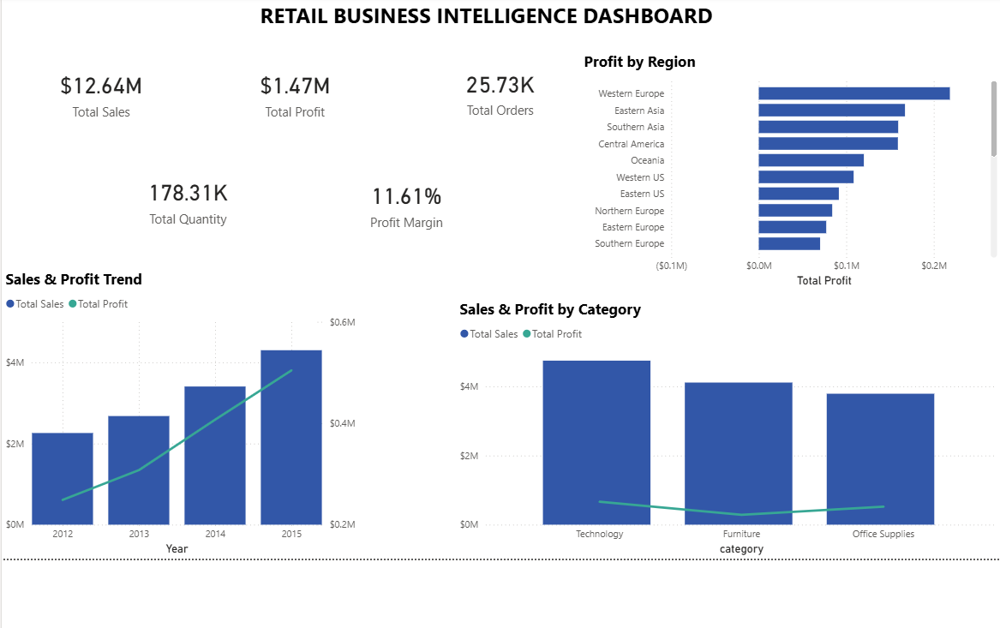
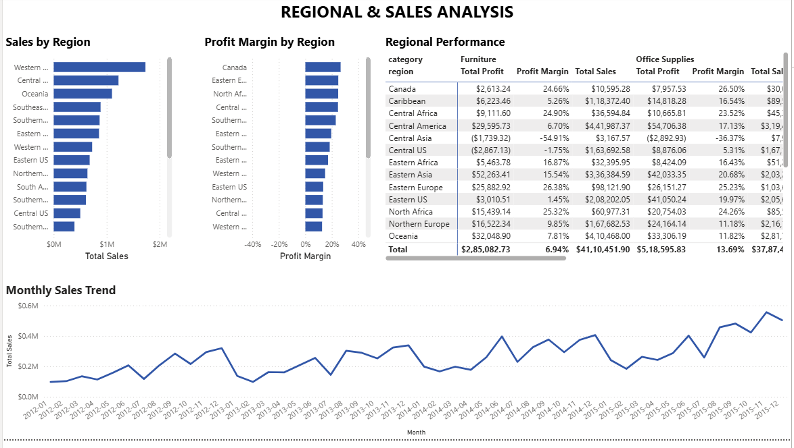
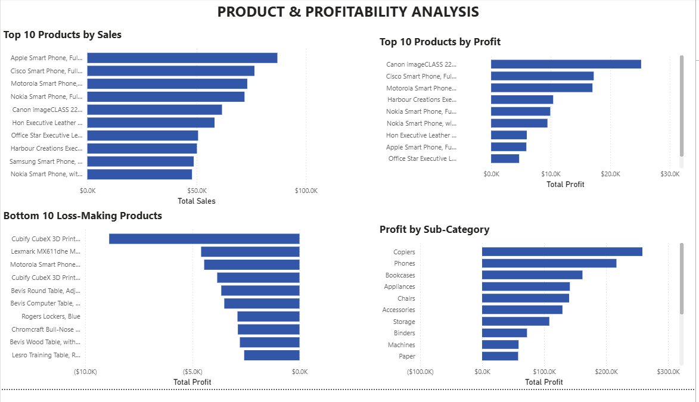
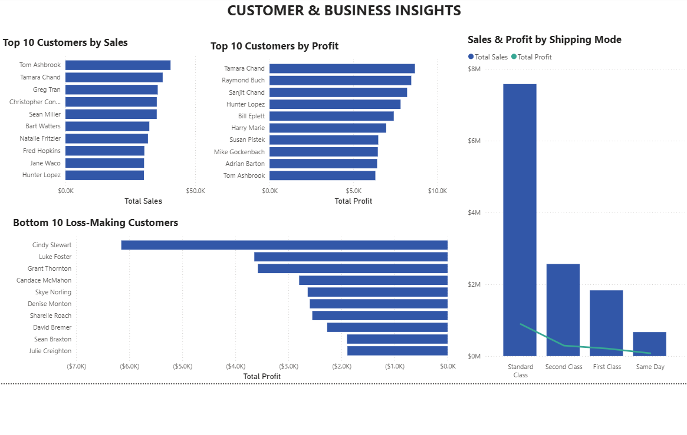

# Retail Business Intelligence Dashboard

## 📊 Project Overview

This project analyzes retail sales performance using SQL and Power BI to understand sales, profitability, regional performance, product performance, customer performance, and shipping operations.

The project combines SQL-based business analysis with an interactive 4-page Power BI dashboard designed to turn transactional retail data into actionable business insights.

---

## 🎯 Business Objectives

The main objectives of this project are to:

- Analyze overall sales and profitability
- Track sales and profit trends over time
- Compare regional performance
- Analyze category and sub-category performance
- Identify top-performing products
- Identify loss-making products
- Identify high-performing and loss-making customers
- Compare sales and profit across shipping modes
- Support business decision-making through interactive visual analysis

---

## 🗂️ Dataset

The project uses a retail transaction dataset containing information related to:

- Orders
- Customers
- Products
- Categories
- Regions
- Shipping modes
- Sales
- Profit
- Quantity
- Discount
- Order dates

The dataset covers multiple years of retail transactions and is used for both SQL analysis and Power BI visualization.

---

## 🛠️ Tools & Technologies

- SQL
- Oracle Database
- Power BI
- DAX
- Microsoft Excel

---

# 📈 Key Performance Indicators

The Power BI dashboard provides the following key metrics:

| KPI | Value |
|---|---:|
| Total Sales | $12.64M |
| Total Profit | $1.47M |
| Total Orders | 25.73K |
| Total Quantity | 178.31K |
| Profit Margin | 11.61% |

---

# 🔎 SQL Analysis

SQL was used to analyze the retail transaction data and answer business-oriented questions related to:

- Overall sales and profit
- Yearly sales and profit performance
- Profit margin
- Regional performance
- Category and sub-category performance
- Product performance
- Loss-making products
- Customer performance
- Loss-making customers
- Shipping mode performance

The SQL analysis provided the analytical foundation for the Power BI dashboard.

---

# 📊 Power BI Dashboard

The Power BI report contains four analytical pages.

## 1. Executive Overview

Provides a high-level summary of business performance.

### Includes:

- Total Sales
- Total Profit
- Total Orders
- Total Quantity
- Profit Margin
- Sales & Profit Trend
- Profit by Region
- Sales & Profit by Category

### Purpose

Provides management with a quick overview of the company's sales, profitability, regional performance, and category performance.

---

## 2. Regional & Sales Analysis

Focuses on geographical performance and sales trends.

### Includes:

- Sales by Region
- Profit Margin by Region
- Regional Performance Matrix
- Monthly Sales Trend

The Regional Performance matrix compares regions across categories using:

- Total Sales
- Total Profit
- Profit Margin

### Purpose

Helps identify strong and weak regions and understand how regional performance changes across product categories and over time.

---

## 3. Product & Profitability Analysis

Focuses on product-level sales and profitability.

### Includes:

- Top 10 Products by Sales
- Top 10 Products by Profit
- Bottom 10 Loss-Making Products
- Profit by Sub-Category

### Purpose

Helps identify products that generate high sales, products that generate high profit, and products that negatively affect overall profitability.

---

## 4. Customer & Business Insights

Focuses on customer performance and shipping operations.

### Includes:

- Top 10 Customers by Sales
- Top 10 Customers by Profit
- Bottom 10 Loss-Making Customers
- Sales & Profit by Shipping Mode

### Shipping Modes Analyzed

- Standard Class
- Second Class
- First Class
- Same Day

### Purpose

Helps identify valuable customers, loss-making customers, and differences in sales and profit across shipping modes.

---

# 💡 Key Business Insights

### Sales and Profit Growth

The business shows an overall upward trend in sales and profit across the analyzed years.

Sales increased from approximately $2.26M in 2012 to approximately $4.30M in 2015.

Profit also increased from approximately $249K in 2012 to approximately $504K in 2015.

---

### Regional Performance

Regional performance varies considerably.

Some regions generate strong sales and profitability, while certain region-category combinations have low or negative profit margins.

This demonstrates the importance of analyzing profitability alongside revenue.

---

### Product Profitability

High sales do not necessarily mean high profitability.

The dashboard separates products into:

- Top products by sales
- Top products by profit
- Loss-making products

This allows product performance to be evaluated using both revenue and profitability.

---

### Loss-Making Products

The Bottom 10 Loss-Making Products analysis identifies products that generate negative profit.

These products should be investigated further based on factors such as:

- Pricing
- Discounts
- Product costs
- Shipping costs
- Sales strategy

---

### Customer Profitability

The customer analysis identifies both high-value customers and customers generating negative profit.

This demonstrates why customer evaluation should consider profitability in addition to sales revenue.

---

### Shipping Performance

Standard Class is the dominant shipping mode in terms of sales and also generates the highest overall profit among the analyzed shipping modes.

---

# 📌 Business Recommendations

Based on the analysis, the following actions can be considered:

### 1. Investigate loss-making products

Review pricing, discounting, costs, and shipping expenses for products consistently generating negative profit.

### 2. Monitor low-margin regions

Investigate regions and region-category combinations with low or negative profit margins.

### 3. Evaluate profitability alongside sales

High revenue should not automatically be treated as strong performance. Products and customers should be evaluated using sales, profit, and profit margin together.

### 4. Review discount strategy

Analyze whether high discounts are contributing to negative or low-margin transactions.

### 5. Monitor customer profitability

Identify customers generating strong revenue but weak or negative profit and review their pricing, discount, and servicing costs.

---

# 📐 Power BI & DAX

The dashboard uses Power BI measures for key business metrics including:

- Total Sales
- Total Profit
- Total Orders
- Total Quantity
- Profit Margin

A dedicated Date Table was also used for time-based analysis such as:

- Year
- Month
- Year-Month
- Monthly Sales Trend
- Yearly Sales and Profit Trend

---

# 🔄 Project Workflow

```text
Retail Transaction Data
        ↓
    SQL Analysis
        ↓
Business Performance Analysis
        ↓
  Power BI Data Model
        ↓
    DAX Measures
        ↓
Interactive Power BI Dashboard
        ↓
   Business Insights
        ↓
Business Recommendations

---

# 📷 Dashboard Preview

## Executive Overview



## Regional & Sales Analysis



## Product & Profitability Analysis



## Customer & Business Insights


